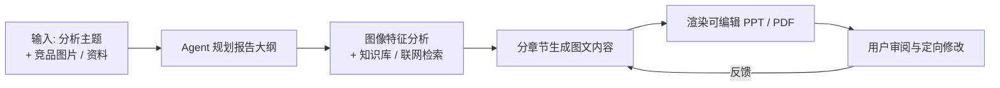

# EquipLens-AI

> AI 驱动的工程车辆外观部件设计前期分析报告生成工具 —— 让 AI 承担资料检索、图像分析与报告初稿制作，设计师专注于判断与创意。

## 1. 项目定位

EquipLens-AI 是一款面向工程机械（挖掘机、装载机、起重机、矿用车辆等）**外观部件设计前期分析**的 AI 辅助工具。它利用大模型的**多模态图像识别、知识检索（RAG）与工具调用**能力，协助设计团队在项目启动阶段快速产出**可编辑的前期分析报告（PPT / PDF）**，将传统需要数天的资料整理与报告制作压缩到小时级。

### 解决的问题

前期分析报告（竞品造型分析、品牌基因研究、趋势研究、法规约束梳理等）目前高度依赖人工：

- 竞品图片收集、分类、特征标注耗时长；
- 多源资料（设计规范、法规标准、历史项目报告）散落各处，检索困难；
- 报告排版、图表制作等格式化工作占用大量创意时间；
- 分析质量依赖个人经验，难以沉淀为可复用的组织资产。

### 目标用户

- 工程机械企业的工业设计 / 造型团队（主要用户）
- CMF 设计师、产品定义工程师
- 设计管理与前期调研人员

## 2. 核心 AI 能力

| 能力 | 在本工具中的用途 |
|---|---|
| 多模态图像识别（VLM） | 竞品图片特征解析：造型语言、覆盖件分块与分缝、灯具 / 格栅 / Logo 区域布局、CMF、风格要素提取与横向对比 |
| 检索增强生成（RAG） | 检索品牌设计规范、法规标准（ISO / GB / EN 等）、历史项目报告、行业趋势资料，并支持引用溯源 |
| 工具调用（Function Calling / MCP） | 联网搜索、图片检索、图表生成、文档解析、PPT / PDF 渲染等 |
| Agent 编排 | 任务规划 → 检索 → 分析 → 撰写 → 渲染报告的多步工作流，关键环节支持人工确认（Human-in-the-loop） |

## 3. 典型工作流



1. **输入**：用户给出分析主题（如"某竞品挖掘机覆盖件造型分析"），上传图片素材或让工具联网收集；
2. **分析**：VLM 解析图像造型特征，RAG 检索品牌规范、法规与历史资料；
3. **撰写**：Agent 按大纲逐章生成图文内容，素材与结论均可溯源；
4. **产出**：渲染为**可编辑 PPT（优先）**或 PDF，文字、图表、版式保持可修改；
5. **迭代**：用户针对章节或素材给出反馈，AI 定向修改后重新渲染。

## 4. 功能模块规划（初步）

| 模块 | 内容 | 优先级 |
|---|---|---|
| M1 图像分析 | 图片上传 / 批量导入、VLM 特征提取、结构化标注（形态语言、分块分缝、特征线、CMF） | P0 |
| M2 素材检索与整理 | 散图自动归类整理（分类 / 去重 / 质检 / 聚类）、联网竞品检索、素材池管理（独立 Agent） | P0（散图整理）/ P1（联网检索） |
| M3 报告生成 | 大纲规划、章节撰写、图表生成、可编辑 PPT / PDF 渲染 | P0 |
| M4 工作台前端 | 项目管理、素材库、报告预览与迭代编辑、导出 | P1 |
| M5 知识库增强（RAG） | 品牌规范 / 法规 / 历史项目知识库接入、引用溯源 | P2 |

## 5. 初步技术方向（待讨论确定）

| 层 | 候选方案 |
|---|---|
| AI 编排 | LangGraph / 自研 Agent 编排；外部工具经 MCP 协议接入 |
| 模型 | 多模态大模型（VLM）+ 文本模型，多供应商可切换（含国产模型） |
| 后端 | Python + FastAPI，流式输出（SSE / WebSocket） |
| 前端 | Web 工作台（React / Vue 待定） |
| 检索 | 向量数据库（pgvector / Milvus / Qdrant 待定）+ 混合检索（向量 + 关键词） |
| 报告渲染 | PPT：python-pptx / pptxgenjs（保证可编辑）；PDF：HTML → PDF |

## 6. 开发范式与规范（原则）

遵循当前 AI 产品开发的主流范式，具体规范文档将随讨论逐步建立并归档至 `docs/`：

- **Spec 驱动开发**：先写需求、接口与数据规格说明，评审后再实现；
- **评测优先（Eval-first）**：为图像分析与内容生成建立评测集与评分标准（LLM-as-judge + 人工抽检），Prompt 或流程变更必须通过评测；
- **Prompt 即资产**：Prompt 版本化管理，与代码同仓同评审；
- **全链路可观测**：每次生成的检索命中、模型调用、耗时与成本可追溯（Tracing）；
- **人在回路**：大纲、素材引用、成稿等关键环节设置确认点，AI 产出必须可溯源；
- **数据合规**：明确企业资料与竞品图片的存储、使用与展示边界。

## 7. 路线图（草案）

| 阶段 | 目标 | 状态 |
|---|---|---|
| P0 | 需求对齐、范围界定、技术选型、规范建立 | 🔄 进行中 |
| P1 | 端到端 MVP：单主题 → 图像分析 + 检索 → 自动生成可编辑 PPT | 待启动 |
| P2 | 知识库与多项目支持、报告迭代编辑体验完善 | 规划中 |
| P3 | 趋势采集、竞品素材库沉淀、评测体系完善 | 规划中 |

## 8. 仓库结构（规划）

```
EquipLens-AI/
├── README.md      # 项目总览（本文件）
├── docs/          # 需求、架构、开发规范、评测文档
├── backend/       # AI 服务与 Agent 编排
├── frontend/      # 工作台前端
├── prompts/       # Prompt 资产（版本化）
├── evals/         # 评测集与评测脚本
└── samples/       # 示例素材与示例报告
```
